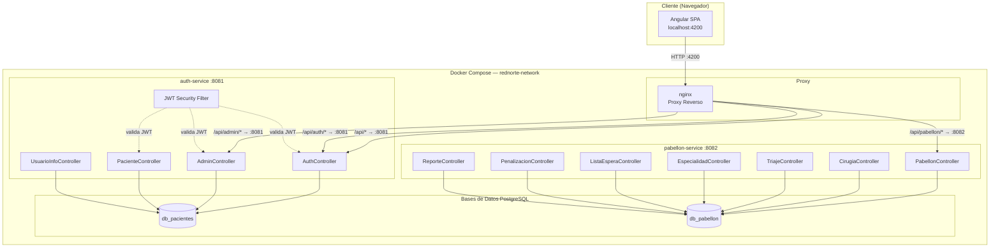
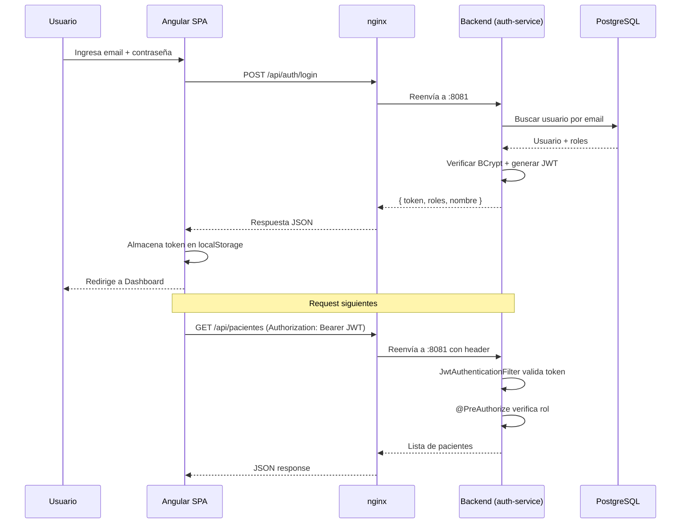
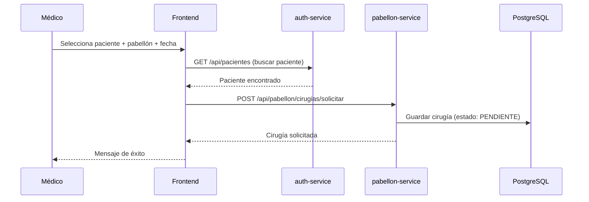
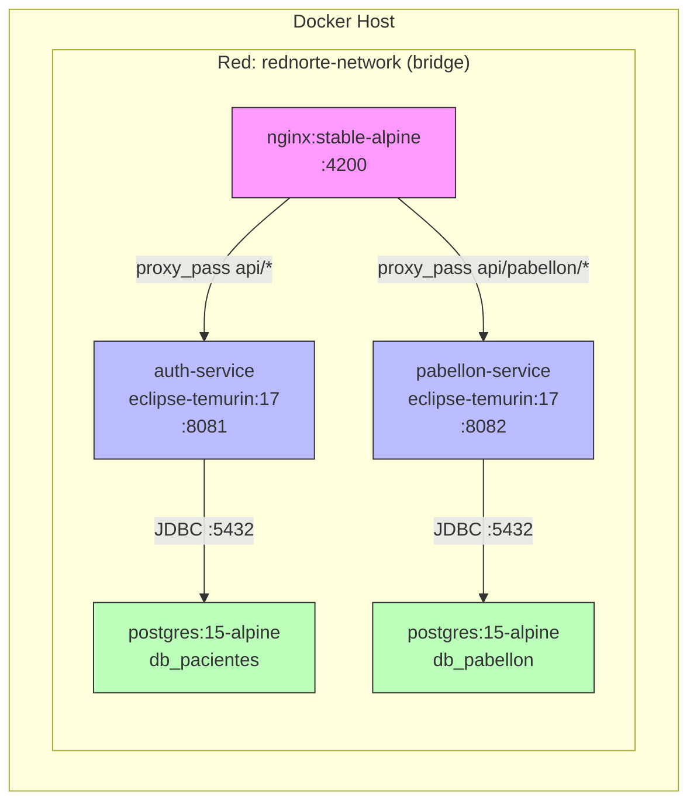

# Paso 2: Diseño de Arquitectura de la Solución

**Proyecto:** RedNorte Stack — Sistema de Gestión Clínica

---

## 1. Diagrama de Arquitectura General

### 1.1 Vista de Alto Nivel



### 1.2 Flujo de Autenticación



### 1.3 Flujo de Solicitud de Cirugía



---

## 2. Estructura de Carpetas del Proyecto

```
Stack/
├── docker-compose.yml                  # Orquestación de 5 servicios
├── AGENTS.md                           # Reglas de trabajo para IA
├── README.md
│
├── BackEnd/                            # Microservicio: autenticación + pacientes
│   ├── Dockerfile                      # Multi-stage: Maven build → JRE runtime
│   ├── pom.xml                         # Maven: Spring Boot 3.5, JPA, Security, JJWT
│   ├── src/
│   │   ├── main/java/cl/duoc/rednorte/
│   │   │   ├── RedNorteApplication.java
│   │   │   ├── auth_service/
│   │   │   │   ├── config/
│   │   │   │   │   ├── DataInitializer.java     # Seed: roles + usuarios ejemplo
│   │   │   │   │   ├── CorsConfig.java
│   │   │   │   │   └── AppConfig.java
│   │   │   │   ├── controller/
│   │   │   │   │   ├── AuthController.java       # /api/auth/*
│   │   │   │   │   ├── AdminController.java      # /api/admin/usuarios
│   │   │   │   │   ├── AdminMedicoController.java # /api/admin/medicos
│   │   │   │   │   └── UsuarioInfoController.java # /api/auth/usuario
│   │   │   │   ├── dto/
│   │   │   │   │   ├── LoginRequestDTO.java
│   │   │   │   │   ├── LoginResponseDTO.java
│   │   │   │   │   ├── RegistroRequestDTO.java
│   │   │   │   │   ├── UsuarioDTO.java
│   │   │   │   │   └── MedicoUpdateRequestDTO.java
│   │   │   │   ├── model/
│   │   │   │   │   ├── Usuario.java              # @Entity (id, rut, nombre, email, contrasena, estado)
│   │   │   │   │   └── Rol.java                  # @Entity (id, nombreRol, descripcion)
│   │   │   │   ├── repository/
│   │   │   │   │   ├── UsuarioRepository.java
│   │   │   │   │   └── RolRepository.java
│   │   │   │   ├── security/
│   │   │   │   │   ├── SecurityConfig.java       # Stateless JWT, BCrypt, CORS
│   │   │   │   │   ├── JwtTokenProvider.java     # Generar/validar tokens HS256
│   │   │   │   │   ├── JwtAuthenticationFilter.java # Filtro OncePerRequest
│   │   │   │   │   └── CustomUserDetailsService.java
│   │   │   │   └── service/
│   │   │   │       ├── AuthService.java
│   │   │   │       ├── AdminService.java
│   │   │   │       └── AdminMedicoService.java
│   │   │   ├── paciente/
│   │   │   │   ├── controller/
│   │   │   │   │   └── PacienteController.java   # /api/pacientes
│   │   │   │   ├── dto/
│   │   │   │   │   └── PacienteResponseDTO.java
│   │   │   │   ├── model/
│   │   │   │   │   └── Paciente.java            # @Entity (prevision, datosClinicos JSON)
│   │   │   │   ├── repository/
│   │   │   │   │   └── PacienteRepository.java
│   │   │   │   └── service/
│   │   │   │       └── PacienteService.java
│   │   │   └── datos_clinicos/
│   │   │       ├── dto/
│   │   │       │   ├── DatosClinicosDTO.java
│   │   │       │   └── DatosClinicosUpdateRequestDTO.java
│   │   │       └── model/
│   │   │           └── DatosClinicos.java       # POJO embebido (JSON column)
│   │   └── resources/
│   │       ├── application.properties           # MySQL local (Laragon)
│   │       └── application-test.yml             # PostgreSQL (Docker)
│
├── PabellonService/                    # Microservicio: cirugías, triaje, pabellones
│   ├── Dockerfile                      # Multi-stage: Maven → JRE
│   ├── pom.xml
│   └── src/main/java/cl/duoc/rednorte/pabellon/
│       ├── PabellonApplication.java
│       ├── config/ (CorsConfig, DataInitializer, GlobalExceptionHandler)
│       ├── controller/
│       │   ├── PabellonController.java
│       │   ├── CirugiaController.java
│       │   ├── TriajeController.java
│       │   ├── EspecialidadController.java
│       │   ├── MedicoEspecialidadController.java
│       │   ├── ListaEsperaController.java
│       │   ├── PenalizacionController.java
│       │   ├── ReporteController.java
│       │   ├── ReasignacionController.java
│       │   └── PacienteCategorizacionController.java
│       ├── dto/ (CirugiaDTO, TriajeDTO, ReasignacionDTO, ReportePerdidasDTO)
│       ├── model/ (Pabellon, Cirugia, Triaje, Especialidad, etc.)
│       ├── repository/ (PabellonRepository, CirugiaRepository, etc.)
│       ├── security/ (SecurityConfig, JwtTokenProvider, JwtAuthenticationFilter)
│       └── service/ (PabellonService, CirugiaService, TriajeService, etc.)
│
├── Frontend/                           # SPA Angular 21 standalone
│   ├── Dockerfile                      # Multi-stage: Node build → nginx serve
│   ├── nginx.conf                      # Proxy reverso a microservicios
│   ├── package.json                    # Angular 21, Vitest
│   └── src/
│       ├── index.html
│       ├── main.ts                     # bootstrapApplication(App)
│       ├── styles.scss
│       ├── environments/
│       │   ├── environment.ts          # apiUrl: 'http://localhost:8080/api'
│       │   └── environment.prod.ts     # apiUrl: '/api'
│       └── app/
│           ├── app.ts                  # Root standalone component
│           ├── app.html
│           ├── app.scss
│           ├── app.config.ts           # Router + HttpClient + interceptor
│           ├── app.routes.ts           # Routes: '', login, dashboard
│           ├── auth.guard.ts           # Guard: verifica expiración JWT
│           ├── auth.interceptor.ts     # Inyecta Bearer token en headers
│           ├── constants.ts            # STORAGE_KEYS
│           ├── home.ts/html/scss       # Landing page (selección portal)
│           ├── login/
│           │   └── login.ts/html/scss
│           ├── dashboard/
│           │   ├── dashboard.ts        # Componente único (658 líneas)
│           │   ├── dashboard.html      # Template con todas las vistas
│           │   └── dashboard.scss
│           ├── core/
│           │   ├── models/
│           │   │   ├── paciente.model.ts
│           │   │   ├── medico.model.ts
│           │   │   ├── triaje.model.ts
│           │   │   └── cirugia.model.ts
│           │   └── services/
│           │       ├── auth.service.ts
│           │       ├── paciente.service.ts
│           │       ├── admin.service.ts
│           │       ├── cirugia.service.ts
│           │       ├── pabellon.service.ts
│           │       ├── triaje.service.ts
│           │       ├── espera.service.ts
│           │       ├── penalizacion.service.ts
│           │       └── reporte.service.ts
│
├── Contenedores_RedNorte/              # Assets adicionales Docker
├── Documento/                          # Documentación extra
│   └── actividad 3.2/                  # ← Entregables de esta actividad
│       ├── 01-analisis-requerimientos.md
│       ├── 02-arquitectura.md
│       ├── 03-backend.md
│       ├── 04-frontend.md
│       ├── 05-pruebas.md
│       └── 06-presentacion.md
│
└── docker-compose.yml                  # 5 servicios: 2 DBs + 2 backends + 1 frontend
```

---

## 3. Diagrama de Despliegue (Docker)



### 3.1 Mapeo de Puertos

| Servicio | Puerto Interno | Puerto Externo | Protocolo |
|----------|---------------|----------------|-----------|
| nginx (frontend) | 80 | 4200 | HTTP |
| auth-service | 8081 | 8080 | HTTP |
| pabellon-service | 8082 | 8082 | HTTP |
| db-postgre | 5432 | — | PostgreSQL |
| db-pabellon | 5432 | — | PostgreSQL |

---

## 4. Decisiones de Diseño

| Decisión | Alternativa | ¿Por qué se eligió esta? |
|----------|-------------|-------------------------|
| **Microservicios vs Monolito** | Monolito Spring Boot | Separación de dominios (auth vs quirúrgico), escalabilidad independiente, equipos paralelos |
| **PostgreSQL vs MySQL** | MySQL (Laragon local) | PostgreSQL soporta JSONB para datos clínicos, mejor rendimiento transaccional, ideal para Docker |
| **Angular standalone** | Angular con NgModules | Menos boilerplate, lazy loading nativo, tendencia actual de Angular |
| **nginx como proxy** | Node.js Express proxy | nginx es más liviano, maneja mejor carga estática, configuración declarativa |
| **JWT vs Session** | Session con Redis | Stateless, no requiere almacenamiento centralizado, fácil de compartir entre microservicios |
| **Bases separadas vs única** | Base única con schemas | Aislamiento total entre dominios, cada equipo dueño de su DB, evita acoplamiento |

---

*Documento generado como parte de la Actividad 3.2 — Taller de Alto Cómputo*
