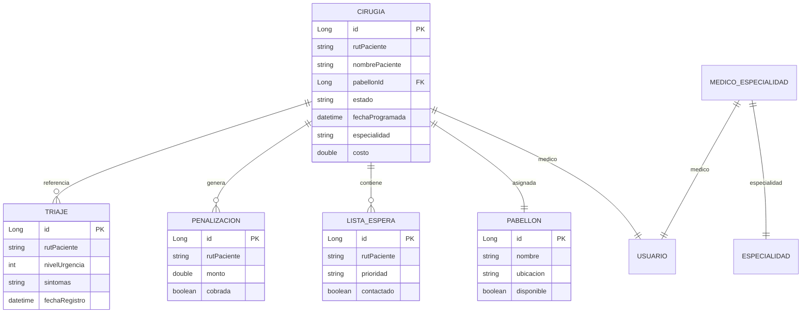

# Paso 3: Desarrollo del Componente Backend

**Proyecto:** RedNorte Stack — Sistema de Gestión Clínica

---

## 1. Resumen de Microservicios

| Microservicio | Puerto Interno | Puerto Expuesto | Base de Datos | Tecnología |
|--------------|---------------|----------------|---------------|------------|
| **auth-service** | 8081 | 8080 | db_pacientes (PostgreSQL) | Spring Boot 3.5 + JPA + Security |
| **pabellon-service** | 8082 | 8082 | db_pabellon (PostgreSQL) | Spring Boot 3.5 + JPA + Security |

---

## 2. auth-service: Endpoints

### 2.1 Autenticación

`Base URL: /api/auth`

| Método | Endpoint | Descripción | Auth | Roles |
|--------|----------|-------------|------|-------|
| POST | `/api/auth/login` | Iniciar sesión (email o rut + contraseña) | No | — |
| POST | `/api/auth/registro` | Registrar nuevo paciente | Sí | ADMIN, MEDICO |
| POST | `/api/auth/admin/registro` | Registrar médico (Admin) | Sí | ADMIN |
| POST | `/api/auth/validar` | Validar token JWT | Sí | Cualquiera autenticado |
| GET | `/api/auth/usuario/rut/{rut}` | Obtener información de usuario por RUT | Sí | Cualquiera autenticado |

#### POST /api/auth/login

```
Request Body:
{
  "email": "admin@rednorte.cl",
  "contrasena": "Admin1234!"
}

Response 200:
{
  "token": "eyJhbGciOiJIUzI1NiJ9...",
  "email": "admin@rednorte.cl",
  "nombre": "Administrador Sistema",
  "rut": "12345678-9",
  "roles": ["ROLE_ADMIN"]
}
```

#### POST /api/auth/registro

```
Request Body:
{
  "rut": "12345678-5",
  "nombre": "Nuevo Paciente",
  "email": "paciente@correo.cl",
  "contrasena": "MiPassword123!",
  "prevision": "FONASA"
}

Response 201:
{
  "mensaje": "Paciente registrado exitosamente",
  "rut": "12345678-5"
}
```

### 2.2 Gestión de Pacientes

`Base URL: /api/pacientes`

| Método | Endpoint | Descripción | Roles |
|--------|----------|-------------|-------|
| GET | `/api/pacientes` | Listar todos los pacientes | ADMIN, MEDICO, TRIAJER, COORDINADOR |
| GET | `/api/pacientes/rut/{rut}` | Buscar paciente por RUT | ADMIN, MEDICO, TRIAJER, COORDINADOR |
| PUT | `/api/pacientes/rut/{rut}/clinicos` | Actualizar datos clínicos | ADMIN, MEDICO |
| DELETE | `/api/pacientes/rut/{rut}` | Eliminar paciente | ADMIN |

#### GET /api/pacientes

```
Response 200:
[
  {
    "idPaciente": 1,
    "prevision": "FONASA",
    "datosClinicosSensibles": {
      "grupoSanguineo": "O+",
      "alergias": ["penicilina"],
      "enfermedadesCronicas": [],
      "pesoKg": 65.5,
      "alturaCm": 168.0
    },
    "idUsuario": 3,
    "rut": "11111111-1",
    "nombre": "María González",
    "email": "paciente@rednorte.cl",
    "estado": true
  }
]
```

#### PUT /api/pacientes/rut/{rut}/clinicos

```
Request Body:
{
  "prevision": "ISAPRE",
  "email": "nuevo@correo.cl",
  "datosClinicosSensibles": {
    "grupoSanguineo": "A+",
    "alergias": ["penicilina", "aspirina"],
    "enfermedadesCronicas": ["hipertensión"],
    "pesoKg": 70.0,
    "alturaCm": 170.0
  }
}

Response 200:
{
  "idPaciente": 1,
  "rut": "11111111-1",
  "nombre": "María González",
  "prevision": "ISAPRE",
  ...
}
```

### 2.3 Administración

`Base URL: /api/admin`

| Método | Endpoint | Descripción | Roles |
|--------|----------|-------------|-------|
| GET | `/api/admin/usuarios` | Listar todos los usuarios del sistema | ADMIN |
| PUT | `/api/admin/usuarios/{id}/estado` | Activar/desactivar usuario | ADMIN |
| GET | `/api/admin/medicos` | Listar médicos registrados | ADMIN |
| PUT | `/api/admin/medicos/{id}` | Actualizar datos de médico | ADMIN |
| DELETE | `/api/admin/medicos/{id}` | Eliminar médico | ADMIN |

---

## 3. pabellon-service: Endpoints

`Base URL: /api/pabellon`

### 3.1 Pabellones

| Método | Endpoint | Descripción | Roles |
|--------|----------|-------------|-------|
| GET | `/api/pabellon/pabellones` | Listar todos los pabellones | ADMIN, MEDICO, COORDINADOR |
| GET | `/api/pabellon/pabellones/disponibles` | Listar pabellones disponibles | ADMIN, MEDICO, COORDINADOR |
| GET | `/api/pabellon/pabellones/{id}` | Obtener pabellón por ID | ADMIN, MEDICO, COORDINADOR |
| POST | `/api/pabellon/pabellones` | Crear pabellón | ADMIN |
| PUT | `/api/pabellon/pabellones/{id}` | Actualizar pabellón | ADMIN |
| DELETE | `/api/pabellon/pabellones/{id}` | Eliminar pabellón | ADMIN |

### 3.2 Cirugías

| Método | Endpoint | Descripción | Roles |
|--------|----------|-------------|-------|
| GET | `/api/pabellon/cirugias` | Listar cirugías (filtros opcionales) | ADMIN, MEDICO, COORDINADOR |
| GET | `/api/pabellon/cirugias/{id}` | Obtener cirugía por ID | ADMIN, MEDICO, COORDINADOR |
| POST | `/api/pabellon/cirugias/solicitar` | Solicitar nueva cirugía | MEDICO |
| PUT | `/api/pabellon/cirugias/{id}/programar` | Programar fecha/pabellón | COORDINADOR |
| PUT | `/api/pabellon/cirugias/{id}/completar` | Marcar cirugía como completada | MEDICO |
| PUT | `/api/pabellon/cirugias/{id}/cancelar` | Cancelar cirugía | MEDICO, COORDINADOR |
| PUT | `/api/pabellon/cirugias/{id}/no-show` | Marcar paciente como no asistido | COORDINADOR |
| POST | `/api/pabellon/cirugias/{id}/reasignar` | Reasignar cirugía a otro pabellón | COORDINADOR |

### 3.3 Triaje

| Método | Endpoint | Descripción | Roles |
|--------|----------|-------------|-------|
| GET | `/api/pabellon/triajes/paciente/{rut}` | Listar triajes de un paciente | TRIAJER, MEDICO |
| POST | `/api/pabellon/triajes` | Guardar nuevo triaje | TRIAJER |
| GET | `/api/pabellon/triajes/ultimo/{rut}` | Obtener último triaje del paciente | TRIAJER, MEDICO |

### 3.4 Especialidades

| Método | Endpoint | Descripción | Roles |
|--------|----------|-------------|-------|
| GET | `/api/pabellon/especialidades` | Listar especialidades médicas | ADMIN, MEDICO, COORDINADOR |
| GET | `/api/pabellon/especialidades/{id}` | Obtener especialidad por ID | ADMIN, MEDICO, COORDINADOR |
| POST | `/api/pabellon/especialidades` | Crear especialidad | ADMIN |

### 3.5 Lista de Espera

| Método | Endpoint | Descripción | Roles |
|--------|----------|-------------|-------|
| GET | `/api/pabellon/lista-espera` | Listar pacientes en espera | ADMIN, COORDINADOR |
| POST | `/api/pabellon/lista-espera/inscribir` | Inscribir paciente en lista de espera | MEDICO |
| PUT | `/api/pabellon/lista-espera/{id}/contactado` | Marcar paciente como contactado | COORDINADOR |
| DELETE | `/api/pabellon/lista-espera/{id}` | Eliminar de lista de espera | ADMIN, COORDINADOR |

### 3.6 Penalizaciones

| Método | Endpoint | Descripción | Roles |
|--------|----------|-------------|-------|
| GET | `/api/pabellon/penalizaciones` | Listar penalizaciones | ADMIN, COORDINADOR |
| GET | `/api/pabellon/penalizaciones/pendientes` | Listar penalizaciones pendientes | ADMIN, COORDINADOR |
| POST | `/api/pabellon/penalizaciones` | Crear penalización | COORDINADOR |
| PUT | `/api/pabellon/penalizaciones/{id}/cobrar` | Marcar penalización como cobrada | COORDINADOR |

### 3.7 Reportes

| Método | Endpoint | Descripción | Roles |
|--------|----------|-------------|-------|
| GET | `/api/pabellon/reportes/perdidas` | Reporte de pérdidas por cirugías no realizadas | ADMIN, COORDINADOR |

---

## 4. Seguridad

### 4.1 Modelo de Autenticación

```
JWT Token:
{
  "sub": "admin@rednorte.cl",
  "rut": "12345678-9",
  "roles": ["ROLE_ADMIN"],
  "iat": 1712345678,
  "exp": 1712432078   // 24 horas
}
```

- **Algoritmo:** HS256
- **Secreto:** 256 bits (configurable via `JWT_SECRET`)
- **Expiración:** 24 horas (configurable via `JWT_EXPIRATION_MS`)

### 4.2 Roles del Sistema

| Rol | Descripción | Acceso |
|-----|-------------|--------|
| ROLE_ADMIN | Administrador del sistema | Todos los endpoints |
| ROLE_MEDICO | Médico o profesional de salud | Pacientes, cirugías, triaje (lectura) |
| ROLE_TRIAJER | Enfermero de triaje | Triaje, pacientes (lectura) |
| ROLE_COORDINADOR | Coordinador quirúrgico | Cirugías, lista espera, penalizaciones, reportes |
| ROLE_PACIENTE | Paciente del sistema | Portal paciente (vista limitada) |

### 4.3 Usuarios Semilla (DataInitializer)

| Email | Contraseña | Rol | RUT |
|-------|-----------|-----|-----|
| admin@rednorte.cl | Admin1234! | ADMIN | 12345678-9 |
| medico@rednorte.cl | Medico1234! | MEDICO | 98765432-1 |
| triajer@rednorte.cl | Triajer1234! | TRIAJER | 33333333-3 |
| coordinador@rednorte.cl | Coordi1234! | COORDINADOR | 11.111.111-1 |
| paciente@rednorte.cl | Paciente1234! | PACIENTE | 11111111-1 |
| paciente2@rednorte.cl | Paciente1234! | PACIENTE | 22222222-2 |

---

## 5. Entidades del Modelo de Datos

### auth-service (db_pacientes)

```mermaid
erDiagram
    USUARIO ||--o{ USUARIO_ROLES : tiene
    ROL ||--o{ USUARIO_ROLES : pertenece
    USUARIO ||--|| PACIENTE : es

    USUARIO {
        Long id PK
        string rut UK
        string nombre
        string email UK
        string contrasena
        boolean estado
    }

    ROL {
        Long id PK
        string nombreRol UK
        string descripcion
    }

    USUARIO_ROLES {
        Long usuario_id FK
        Long rol_id FK
    }

    PACIENTE {
        Long id PK
        Long usuario_id FK UK
        string prevision
        jsonb datos_clinicos_sensibles
    }
```

### pabellon-service (db_pabellon)



---

## 6. Cómo Probar los Endpoints

### Prerrequisitos

```bash
# Iniciar todos los servicios
docker compose up -d --build

# Verificar que todos los contenedores estén running
docker ps
```

### Probar con curl

```bash
# 1. Login como Admin
curl -X POST http://localhost:8080/api/auth/login \
  -H "Content-Type: application/json" \
  -d '{"email":"admin@rednorte.cl","contrasena":"Admin1234!"}'
# → Guardar token de la respuesta

# 2. Listar pacientes (usando el token)
curl -X GET http://localhost:8080/api/pacientes \
  -H "Authorization: Bearer <TOKEN>"

# 3. Buscar paciente por RUT
curl -X GET http://localhost:8080/api/pacientes/rut/11111111-1 \
  -H "Authorization: Bearer <TOKEN>"

# 4. Probar con rol no autorizado (Triajer → antes del fix daba 403)
curl -X POST http://localhost:8080/api/auth/login \
  -d '{"email":"triajer@rednorte.cl","contrasena":"Triajer1234!"}'

curl -X GET http://localhost:8080/api/pacientes \
  -H "Authorization: Bearer <TOKEN_DE_TRIAJER>"
# → 200 OK (después del fix que agrega ROLE_TRIAJER al @PreAuthorize)
```

---

## 7. Mejora Realizada Durante la Actividad

Se identificó y corrigió un bug de autorización:

- **Problema:** El endpoint `GET /api/pacientes` tenía `@PreAuthorize("hasAnyAuthority('ROLE_ADMIN', 'ROLE_MEDICO')")`, excluyendo a `ROLE_TRIAJER` y `ROLE_COORDINADOR`, que también necesitan listar pacientes.
- **Solución:** Se agregaron ambos roles al `@PreAuthorize` en `PacienteController.java:25`:
  ```java
  @PreAuthorize("hasAnyAuthority('ROLE_ADMIN', 'ROLE_MEDICO', 'ROLE_TRIAJER', 'ROLE_COORDINADOR')")
  ```
- **Archivos modificados:** `BackEnd/src/main/java/cl/duoc/rednorte/paciente/controller/PacienteController.java`
  - Línea 25: `listarTodos()` — agregados roles
  - Línea 41: `buscarPorRut()` — agregados roles

---

*Documento generado como parte de la Actividad 3.2 — Taller de Alto Cómputo*
