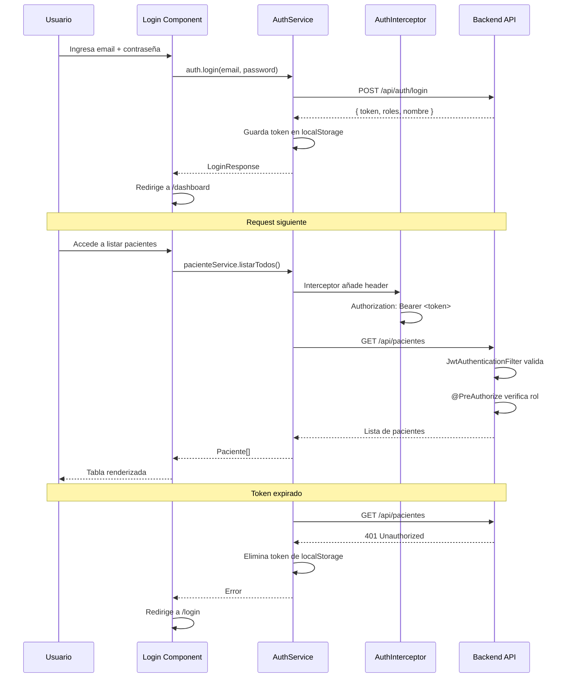

# Paso 4: Desarrollo del Componente Frontend

**Proyecto:** RedNorte Stack — Sistema de Gestión Clínica
**Tecnología:** Angular 21 Standalone Components + TypeScript 5.9 + Vitest

---

## 1. Estructura del Frontend

```
Frontend/src/app/
├── app.ts / app.html / app.scss     # Componente raíz (standalone)
├── app.config.ts                     # Config: Router + HttpClient + Interceptor
├── app.routes.ts                     # Definición de rutas
├── auth.guard.ts                     # Guard: redirige si token expirado
├── auth.interceptor.ts               # Inyecta Bearer JWT en cada HTTP request
├── constants.ts                      # Storage keys para localStorage
│
├── home.ts/html/scss                 # Landing page (selección de portal)
├── login/
│   └── login.ts/html/scss           # Formulario de inicio de sesión
│
├── dashboard/
│   ├── dashboard.ts                  # Componente principal (658 líneas)
│   ├── dashboard.html                # Template con todas las vistas (952 líneas)
│   └── dashboard.scss                # Estilos del dashboard
│
└── core/
    ├── models/
    │   ├── paciente.model.ts
    │   ├── medico.model.ts
    │   ├── triaje.model.ts
    │   └── cirugia.model.ts
    └── services/
        ├── auth.service.ts           # Login, registro, CRUD médicos
        ├── paciente.service.ts       # CRUD pacientes
        ├── admin.service.ts          # Gestión usuarios
        ├── cirugia.service.ts        # CRUD cirugías + solicitar/programar
        ├── pabellon.service.ts       # Pabellones y especialidades
        ├── triaje.service.ts         # Guardar/listar triajes
        ├── espera.service.ts         # Lista de espera
        ├── penalizacion.service.ts   # Penalizaciones
        └── reporte.service.ts        # Reportes
```

---

## 2. Routing

| Ruta | Componente | Guard | Descripción |
|------|-----------|-------|-------------|
| `/` | Home | No | Landing page con selección de portal (rol simulado) |
| `/login` | Login | No | Formulario de autenticación |
| `/dashboard` | Dashboard | `authGuard` | Panel principal con todas las vistas internas |

### Configuración (app.routes.ts)

```typescript
export const routes: Routes = [
    {path: '', component: Home, pathMatch: 'full'},
    {path: 'login', component: Login},
    {path: 'dashboard', component: Dashboard, canActivate: [authGuard]}
];
```

---

## 3. Componentes y Vistas del Dashboard

El dashboard es un **componente único** que renderiza diferentes vistas según la variable `vistaActual`. Cada vista corresponde a un módulo funcional.

### 3.1 Directorio Pacientes (`vistaActual = 'listado'`)

- **Propósito:** Listar todos los pacientes del sistema
- **Features:**
  - Tabla con columnas: RUT, Nombre, Email, Previsión, Acciones
  - Búsqueda por RUT o nombre
  - Botones: Ver detalle, Editar, Eliminar
- **API:**
  - `GET /api/pacientes` (listar todos)
  - `GET /api/pacientes/rut/{rut}` (buscar)
  - `DELETE /api/pacientes/rut/{rut}` (eliminar)

### 3.2 Detalle Paciente (`vistaActual = 'detalle'`)

- **Propósito:** Ver y editar ficha completa del paciente
- **Features:**
  - Datos personales (RUT, nombre, email, previsión)
  - Datos clínicos (grupo sanguíneo, peso, altura, alergias, enfermedades crónicas)
  - Modo edición: formulario con campos editables
  - Lista dinámica de alergias y enfermedades (agregar/remover)
- **API:**
  - `PUT /api/pacientes/rut/{rut}/clinicos`

### 3.3 Registro Paciente (`vistaActual = 'registro'`)

- **Propósito:** Registrar un nuevo paciente en el sistema
- **Features:**
  - Formulario completo: RUT, nombre, email, contraseña, previsión
  - Validaciones en cliente
- **API:**
  - `POST /api/auth/registro`

### 3.4 Triaje (`vistaActual = 'triaje'`)

- **Propósito:** Ingreso y consulta de triajes (vista de Triajer)
- **Features:**
  - Búsqueda de paciente por RUT
  - Formulario: nivel urgencia (1-5), síntomas, fecha
  - Historial de triajes del paciente
- **API:**
  - `GET /api/pabellon/triajes/paciente/{rut}`
  - `POST /api/pabellon/triajes`

### 3.5 Mis Cirugías (`vistaActual = 'misCirugias'`)

- **Propósito:** Listar cirugías del médico logueado
- **Features:**
  - Tabla: paciente, especialidad, pabellón, fecha, estado
  - Filtro de estado (PENDIENTE, PROGRAMADA, COMPLETADA, CANCELADA)
  - Botones: Completar, Cancelar
- **API:**
  - `GET /api/pabellon/cirugias`

### 3.6 Solicitar Cirugía (`vistaActual = 'solicitarCirugia'`)

- **Propósito:** Solicitar una nueva cirugía
- **Features:**
  - Selector de paciente (búsqueda por RUT)
  - Selector de especialidad
  - Selector de pabellón
  - Fecha y hora programada
- **API:**
  - `POST /api/pabellon/cirugias/solicitar`

### 3.7 Solicitudes Pendientes (`vistaActual = 'solicitudesPendientes'`)

- **Propósito:** Vista del Coordinador para gestionar solicitudes
- **Features:**
  - Lista de cirugías solicitadas (estado PENDIENTE)
  - Botón: Programar (asignar fecha y pabellón)
- **API:**
  - `GET /api/pabellon/cirugias`
  - `PUT /api/pabellon/cirugias/{id}/programar`

### 3.8 Métricas (`vistaActual = 'metricas'`)

- **Propósito:** Indicadores de actividad quirúrgica
- **Features:**
  - Cards: Total cirugías, Completadas, Canceladas, No-show
  - Gráfico de barras simple (CSS nativo)
  - Tabla de ocupación por pabellón
- **API:**
  - `GET /api/pabellon/cirugias`

### 3.9 Lista de Espera (`vistaActual = 'listaEspera'`)

- **Propósito:** Gestión de pacientes en espera
- **Features:**
  - Tabla: paciente, prioridad, especialidad, contactado
  - Botón: Marcar contactado, Eliminar
- **API:**
  - `GET /api/pabellon/lista-espera`
  - `PUT /api/pabellon/lista-espera/{id}/contactado`
  - `DELETE /api/pabellon/lista-espera/{id}`

### 3.10 Penalizaciones (`vistaActual = 'penalizaciones'`)

- **Propósito:** Administración de penalizaciones por no-show
- **Features:**
  - Lista de penalizaciones (pendientes y cobradas)
  - Botón: Cobrar penalización
  - Monto total de penalizaciones pendientes
- **API:**
  - `GET /api/pabellon/penalizaciones/pendientes`
  - `PUT /api/pabellon/penalizaciones/{id}/cobrar`

### 3.11 Reportes (`vistaActual = 'reportes'`)

- **Propósito:** Reporte de pérdidas económicas
- **Features:**
  - Selector de rango de fechas (inicio/fin)
  - Tabla con detalle de pérdidas por cirugía no realizada
  - Total de pérdidas en el período
- **API:**
  - `GET /api/pabellon/reportes/perdidas?fechaInicio=&fechaFin=`

### 3.12 Gestión Médicos (`vistaActual = 'listadoMedicos'`)

- **Propósito:** CRUD de médicos (solo Admin)
- **Features:**
  - Tabla de médicos registrados
  - Formulario para crear/editar médico
  - Botón: Eliminar médico
- **API:**
  - `GET /api/admin/medicos`
  - `POST /api/auth/admin/registro`
  - `PUT /api/admin/medicos/{id}`
  - `DELETE /api/admin/medicos/{id}`

### 3.13 Gestión Usuarios (`vistaActual = 'gestionUsuarios'`)

- **Propósito:** Activar/desactivar usuarios del sistema
- **Features:**
  - Tabla: nombre, email, roles, estado
  - Toggle para activar/desactivar
- **API:**
  - `GET /api/admin/usuarios`
  - `PUT /api/admin/usuarios/{id}/estado`

---

## 4. Servicios (Core Services)

Todos los servicios son `providedIn: 'root'` (singleton) y utilizan `HttpClient` con el `authInterceptor` que inyecta automáticamente el token JWT.

| Servicio | Métodos Clave | API Base |
|----------|--------------|----------|
| `AuthService` | `login()`, `registrarPaciente()`, `registrarMedico()` | `/api/auth` |
| `PacienteService` | `listarTodos()`, `buscarPorRut()`, `actualizarClinicos()`, `eliminar()` | `/api/pacientes` |
| `AdminService` | `listarUsuarios()`, `cambiarEstado()` | `/api/admin` |
| `CirugiaService` | `listar()`, `solicitar()`, `programar()`, `completar()`, `cancelar()` | `/api/pabellon/cirugias` |
| `PabellonService` | `listarTodos()`, `listarDisponibles()`, `listarEspecialidades()` | `/api/pabellon/pabellones` |
| `TriajeService` | `guardar()`, `listarPorPaciente()` | `/api/pabellon/triajes` |
| `EsperaService` | `listar()`, `inscribir()`, `marcarContactado()`, `eliminar()` | `/api/pabellon/lista-espera` |
| `PenalizacionService` | `listarPendientes()`, `crear()`, `marcarCobrada()` | `/api/pabellon/penalizaciones` |
| `ReporteService` | `reportePerdidas()` | `/api/pabellon/reportes` |

---

## 5. Flujo de Autenticación Completo



---

## 6. Seguridad en el Frontend

- **Auth Guard** (`auth.guard.ts`): verifica que el token exista y no esté expirado antes de cargar el dashboard
- **Interceptor** (`auth.interceptor.ts`): agrega automáticamente `Authorization: Bearer <token>` a cada HTTP request
- **401 handling**: si el backend responde 401, se elimina el token y redirige a login
- **Almacenamiento**: token en `localStorage` (clave `token_clinica`)
- **Roles en UI**: las vistas se muestran/ocultan según `rolActual` (ej: `@if (rolActual === 'Triajer')`)

---

*Documento generado como parte de la Actividad 3.2 — Taller de Alto Cómputo*
